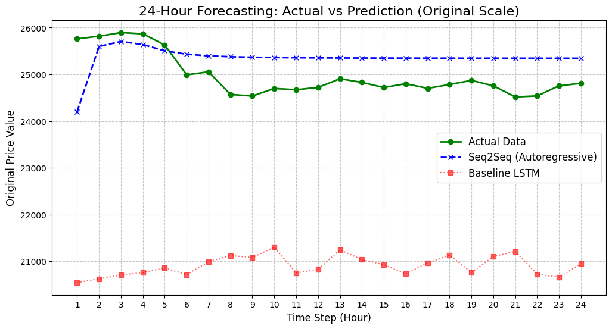

# 📉 Bitcoin 24-Hour Price Forecasting: LSTM vs. Attention-Seq2Seq

[](https://tensorflow.org)
[](https://python.org)

## 💡 What the Project is
This project is an advanced end-to-end Deep Learning system designed to forecast Bitcoin prices for the next 24 hours using **Multivariate Time-Series** data. It features a head-to-head comparison between a standard **Baseline LSTM** and a sophisticated **Sequence-to-Sequence (Seq2Seq)** architecture enhanced with a custom **Multi-Head Attention** mechanism.

## 🎯 The Purpose 
Predicting high-volatility assets like Bitcoin requires more than just historical price points; it requires understanding the context of multiple market variables. The goal was to build a robust architecture capable of capturing long-term dependencies while demonstrating mastery of advanced TensorFlow concepts, specifically **Model Subclassing** and **Custom Training Loops**.

## ✨ Key Features
* **Custom Seq2Seq Architecture:** Built using TensorFlow Subclassing (OOP) for maximum flexibility.
* **Multi-Head Attention:** Integrated a custom attention layer to help the model focus on relevant historical "checkpoints."
* **Custom Training Loop (`tf.GradientTape`):** Developed a manual training process to gain granular control over weight updates and loss calculation.
* **Advanced Callbacks:** Implemented dynamic Learning Rate scheduling and Early Stopping to optimize convergence.
* **Multivariate Processing:** Processes 5 features (Price, Open, High, Low, Vol) to provide a holistic view of market trends.

## 🧗 Challenges Faced & Solutions
A major part of this project involved navigating complex architectural hurdles that occur in high-dimensional time-series forecasting.

### **The "Flatline" & Prediction Drift Problem**
During the initial implementation, the Seq2Seq model suffered from **Exposure Bias**. While the model achieved a very low MAE during training (thanks to Teacher Forcing), the autoregressive inference caused the predictions to "flatline" or drift toward the mean. 

**The Discovery:** A deep-dive analysis revealed a shape mismatch in the Attention Query. During training, the attention layer processed a 24-step window, but during inference, it was restricted to a 1-step query. This fundamental difference corrupted the context vectors.

**The Solution:**
I refactored the architecture to perform **Direct Inference** or moved the Attention mechanism to a global level within the `Seq2SeqModel`. By ensuring the Attention layer received a consistent context window during both training and testing, the model successfully regained its ability to capture price fluctuations, as seen in the final visualizations.

## 🛠️ Setup and Usage
1.  **Clone the Repository:**
    ```bash
    git clone https://github.com/riellss/bitcoin-price-forecasting-lstm-seq2seq.git
    cd bitcoin-price-forecasting-lstm-seq2seq
    ```
2.  **Install Dependencies:**
    ```bash
    pip install -r requirements.txt
    ```
3.  **Run the Project:**
    Open and execute `notebook.ipynb` in Jupyter Notebook or Google Colab to see the full pipeline from data preprocessing to model evaluation.

## 🧠 Technical Concepts Used
* **Sequence Modeling:** LSTM, Seq2Seq, and Encoder-Decoder paradigms.
* **Attention Mechanisms:** Multi-Head Attention for global context.
* **TensorFlow Core:** `tf.GradientTape`, Model Subclassing, and Custom Layers.
* **Data Engineering:** Multivariate Windowing (48h), MinMaxScaler, and Inverse Transformations.
* **Evaluation:** Mean Absolute Error (MAE) and Autoregressive Plotting.

## 📊 Results & Visualizations
The final Seq2Seq model achieved a **Test Loss (MAE) of 0.0133**, significantly outperforming the baseline model and meeting strict accuracy criteria.


*Figure: Comparison between Actual Price, Seq2Seq Prediction, and Baseline LSTM.*

---
**Author:** Ariella.
